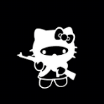

# Landing Page Project



Este es un proyecto de página de aterrizaje (landing page) desarrollado como parte del currículo de The Odin Project. La página está diseñada para ser responsiva y utiliza HTML5 y CSS3 moderno.

## Características

- Diseño responsivo que se adapta a diferentes tamaños de pantalla
- Barra de navegación con menú adaptable
- Secciones bien estructuradas
- Tipografías personalizadas de Google Fonts
- Estilos CSS modernos con Flexbox

## Tecnologías Utilizadas

- HTML5
- CSS3
  - Flexbox para el diseño
  - Media Queries para la responsividad
- Google Fonts
  - Cabin Sketch
  - Freckle Face

## Estructura del Proyecto

```
project_landing_page/
├── index.html          # Archivo principal HTML
├── styles.css         # Estilos CSS
├── dark-kitty.png     # Imagen de ejemplo
└── README.md          # Este archivo
```

## Cómo Usar

1. Clona este repositorio o descarga los archivos
2. Abre el archivo `index.html` en tu navegador web
3. Explora la página y redimensiona la ventana del navegador para ver la respuesta responsiva

## Personalización

Puedes personalizar esta landing page modificando:

- Los colores en el archivo `styles.css`
- El contenido en el archivo `index.html`
- Las fuentes en las etiquetas `<link>` del `index.html`
- Las imágenes reemplazando `dark-kitty.png`

## Vista Previa


## Créditos

- [The Odin Project](https://www.theodinproject.com/)
- [Google Fonts](https://fonts.google.com/)

---

Desarrollado como parte del currículo de [The Odin Project](https://www.theodinproject.com/).
